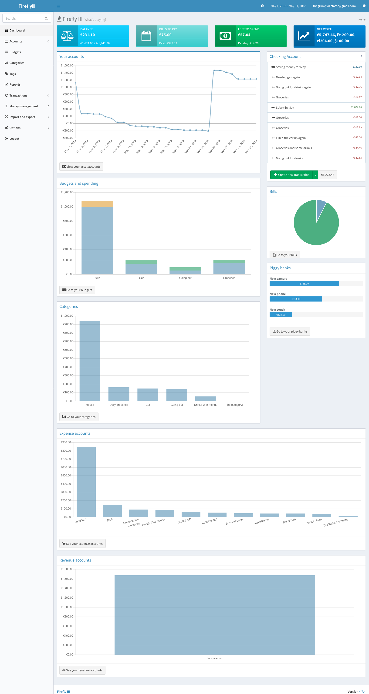

# Firefly III for YunoHost

[](https://dash.yunohost.org/appci/app/firefly-iii)  
[](https://install-app.yunohost.org/?app=firefly-iii)

> *This package allows you to install Firefly III quickly and simply on a YunoHost server.
If you don't have YunoHost, please consult [the guide](https://yunohost.org/#/install) to learn how to install it.*

## Overview
"Firefly III" is a (self-hosted) manager for your personal finances. It can help you keep track of your expenses and income, so you can spend less and save more. Firefly III supports the use of budgets, categories and tags. It can import data from external sources and it has many neat financial reports available. You can [read all about it in the main repository](https://github.com/firefly-iii/firefly-iii) and in the [official documentation](https://firefly-iii.readthedocs.io/en/latest/).

**Shipped version:** 5.4.6

## Screenshots



## Demo

* [Demo 1](https://demo.firefly-iii.org/login)
* [Demo 2](http://www.softaculous.com/softaculous/demos/Firefly_III)

## Documentation

 * Official documentation: https://docs.firefly-iii.org/

## YunoHost specific features

#### Multi-user support

- The admin user should be the first user to log into Firefly III
- SSO is not working yet
- You will probably be warned about missing locale from your system. Once you change the language to those corresponding to your system, the warning will desapear

#### Supported architectures

* x86-64 - [](https://ci-apps.yunohost.org/ci/apps/firefly-iii/)
* ARMv8-A - [](https://ci-apps-arm.yunohost.org/ci/apps/firefly-iii/)

## Links

 * Report a bug: https://github.com/YunoHost-Apps/firefly-iii_ynh/issues
 * App website: https://firefly-iii.org/
 * Upstream app repository: https://github.com/firefly-iii/firefly-iii
 * YunoHost website: https://yunohost.org/

TODO
 - [ ] Make Firefly III admin user dependant of the user choosen at installation
 - [ ] Make SSO work
 - [ ] Define default language according to system language

---

Developer info
----------------

Please send your pull request to the [testing branch](https://github.com/YunoHost-Apps/firefly-iii_ynh/tree/testing).

To try the testing branch, please proceed like that.
```
sudo yunohost app install https://github.com/YunoHost-Apps/firefly-iii_ynh/tree/testing --debug
or
sudo yunohost app upgrade firefly-iii -u https://github.com/YunoHost-Apps/firefly-iii_ynh/tree/testing --debug
```
