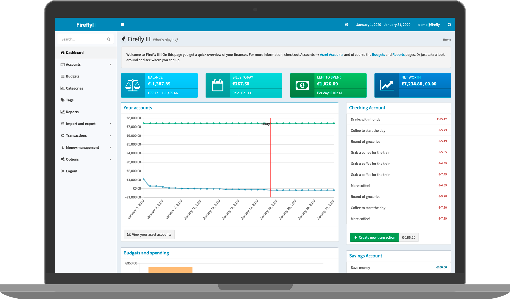

<!--
Este archivo README esta generado automaticamente<https://github.com/YunoHost/apps/tree/master/tools/readme_generator>
No se debe editar a mano.
-->

# Firefly III para Yunohost

[](https://ci-apps.yunohost.org/ci/apps/firefly-iii/)


[](https://install-app.yunohost.org/?app=firefly-iii)

*[Leer este README en otros idiomas.](./ALL_README.md)*

> *Este paquete le permite instalarFirefly III rapidamente y simplement en un servidor YunoHost.*  
> *Si no tiene YunoHost, visita [the guide](https://yunohost.org/install) para aprender como instalarla.*

## Descripción general

Firefly III is a manager for your personal finances. It can help you keep track of your expenses and income, so you can spend less and save more. Firefly III supports the use of budgets, categories and tags. Using external tools, ie [Firefly III Importer](https://github.com/YunoHost-Apps/firefly-iii-di_ynh), you can import data. It also has many neat financial reports available.


**Versión actual:** 6.2.0~ynh1

**Demo:** <https://demo.firefly-iii.org/login>

## Capturas



## Documentaciones y recursos

- Sitio web oficial: <https://firefly-iii.org/>
- Documentación administrador oficial: <https://docs.firefly-iii.org/firefly-iii/about-firefly-iii/introduction/>
- Repositorio del código fuente oficial de la aplicación : <https://github.com/firefly-iii/firefly-iii>
- Catálogo YunoHost: <https://apps.yunohost.org/app/firefly-iii>
- Reportar un error: <https://github.com/YunoHost-Apps/firefly-iii_ynh/issues>

## Información para desarrolladores

Por favor enviar sus correcciones a la [rama `testing`](https://github.com/YunoHost-Apps/firefly-iii_ynh/tree/testing).

Para probar la rama `testing`, sigue asÍ:

```bash
sudo yunohost app install https://github.com/YunoHost-Apps/firefly-iii_ynh/tree/testing --debug
o
sudo yunohost app upgrade firefly-iii -u https://github.com/YunoHost-Apps/firefly-iii_ynh/tree/testing --debug
```

**Mas informaciones sobre el empaquetado de aplicaciones:** <https://yunohost.org/packaging_apps>
