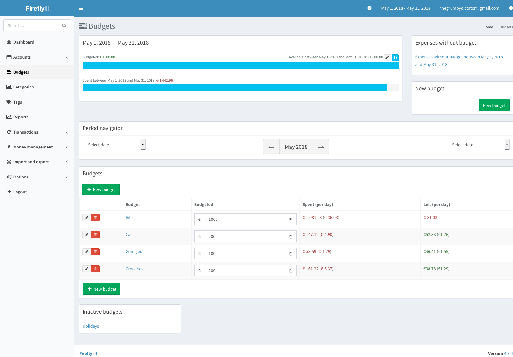
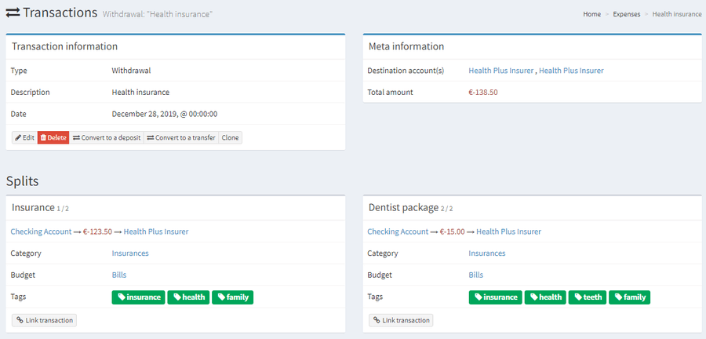

# Firefly III pour YunoHost

[](https://dash.yunohost.org/appci/app/firefly-iii)    
[](https://install-app.yunohost.org/?app=firefly-iii)

*[Read this readme in english.](./README.md)*
*[Lire ce readme en français.](./README_fr.md)*

> *Ce package vous permet d'installer Firefly III rapidement et simplement sur un serveur YunoHost.
Si vous n'avez pas YunoHost, regardez [ici](https://yunohost.org/#/install) pour savoir comment l'installer et en profiter.*

## Vue d'ensemble

Gestionnaire de finances personnelles

**Version incluse :** 5.5.12~ynh1

**Démo :** https://demo.firefly-iii.org/login

## Captures d'écran




## Documentations et ressources

* Site officiel de l'app : https://firefly-iii.org/
* Documentation officielle utilisateur : https://yunohost.org/apps
* Documentation officielle de l'admin : https://docs.firefly-iii.org/firefly-iii/about-firefly-iii/introduction/
* Dépôt de code officiel de l'app : https://github.com/firefly-iii/firefly-iii
* Documentation YunoHost pour cette app : https://yunohost.org/app_firefly-iii
* Signaler un bug : https://github.com/YunoHost-Apps/firefly-iii_ynh/issues

## Informations pour les développeurs

Merci de faire vos pull request sur la [branche testing](https://github.com/YunoHost-Apps/firefly-iii_ynh/tree/testing).

Pour essayer la branche testing, procédez comme suit.
```
sudo yunohost app install https://github.com/YunoHost-Apps/firefly-iii_ynh/tree/testing --debug
ou
sudo yunohost app upgrade firefly-iii -u https://github.com/YunoHost-Apps/firefly-iii_ynh/tree/testing --debug
```

**Plus d'infos sur le packaging d'applications :** https://yunohost.org/packaging_apps